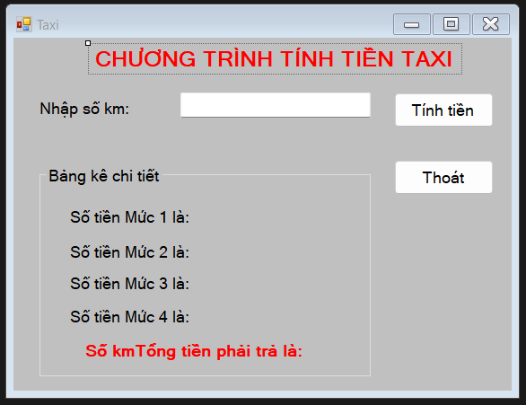
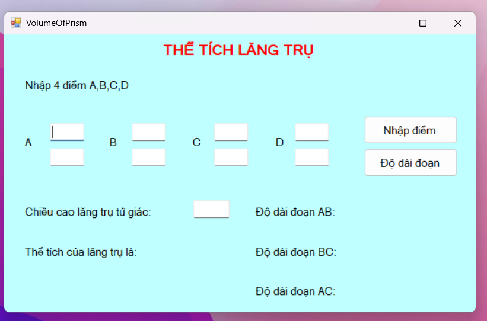

> Thực hiện: **Huỳnh Tấn Chương**
>
> Cập nhật lần cuối: **00/00/0000**

# Bài tập Winform bằng ngôn ngữ C#

### Mực lục

[Bài 2 - trang 33](#2-33)

[Bài 3 - trang 33](#3-33)

[Bài 4 - trang 34](#4-34)

[Bài 5 - trang 34](#5-34)

[Bài 6 - trang 35](#6-35)

[Bài 7 - trang 36](#7-36)

[Bài 8 - trang 37](#8-37)

[Bài 9 - trang 38](#9-38)

[Bài 10 - trang 39](#10-39)

[Bài tập bổ sung 1](#bs1)

[Bài tập bổ sung 2](#bs2)

[Bài tập bổ sung 3](#bs3)

[Bài tập bổ sung 4](#bs4)

# Bài tập Chương 2

### Bài 2 - trang 33
- Thiết kế form như hình bên dưới:

- Khi người dùng nhập vào các thông tin trên các TextBox: Họ tên, ngày sinh sở thích và nhấn nút **Xác nhận** thì sẽ xuất hiện một hộp thoại xác nhận lại những thông tin đã nhập.

### Bài 3 - trang 33
- Thiết kế form thực hiện các chức năng sau:

- Yêu cầu: 
    + Khi nhấn Laptop, USB, Mouse sẽ hiển thị tên các loại sản phẩm tương ứng trên ListBox và các hình thể hiện minh họa trên các PictureBox.
    + Khi nhấn trên ListBox, chỉ hiển thị duy nhất 1 hình của sản phẩm đang chọn.
    

### Bài 4 - trang 34
- Thiết kế giao diện bằng ListBox có các giá trị: Việt Nam, Nhật Bản, Hàn Quốc, Trung Quốc. Khi người dùng nhập nội dung vào TextBox và nhấn nút Thêm nội dung sẽ hiển thị trên TextBox. Nếu người dùng chỉnh sửa nội dung trên TextBox và nhấn nút Cập nhật thì nội dung sẽ được cập nhật vào ListBox, nếu chọn Xóa thì nội dung sẽ được xóa khỏi ListBox.

### Bài 5 - trang 34
- Thiết kế giao diện như hình bên dưới:

- Yêu cầu:
    + Thiết kế giao diện.
    + Khi người dùng nhập thông tin vào TextBox Tên món và chọn Nước uống hoặc Món ăn và nhấn nút Thêm thì thông tin món ăn sẽ được thêm vào ListBox tương ứng.
    + Chọn 1 Món ăn và nhấn nút ` >> ` thì dòng dữ liệu được chọn bên Món ăn sẽ được xóa khỏi ListBox Món ăn và thêm vào ListBox Nước uống.
    + Chọn 1 Nước uống và nhấn nút ` << ` thì dòng dữ liệu được chọn bên Nước uống sẽ được xóa khỏi ListBox Nước uống và thêm vào ListBox Món ăn.

### Bài 6 - trang 35
- Thiết giao diện như hình bên dưới:

- Yêu cầu:
    + Thiết kế giao diện.
    + Combobox loại xe gồm các loại xe: Vision, Click, SH mode. Khi chọn 1 loại xe sẽ hiển thị thông tin tương ứng như bảng bên dưới.
    
        | *Loại xe*  | *Màu*    | *Đơn giá*    |
        |:----------:|:--------:|:------------:| 
        |  Vision    | Xanh     | 35.000.000   |
        |  Click     | Trắng    | 42.000.000   |
        |  SH mode   | Đỏ       | 50.000.000   |
    
    + Khi người dùng chọn số lượng và nhấn nút *Tính tiền* thì giá tiền hiển thị trong Label Thành tiền.

### Bài 7 - trang 36
- Thiết kế giao diện như hình bên dưới: 

- Yêu cầu:
    + Thiết kế giao diện, Combobox Lớp gồm có 2 lớp là: Cao đẳng 17 và Cao đẳng 18.
    + Khi chọn lớp **Cao đẳng 17** sẽ hiển thị các thông tin tương ứng như sau:

        | *Họ tên*      | *Lập trình GD* | *Mạng MT* | *CSDL SQL* |
        |:-------------:|:--------------:|:---------:|:----------:|
        | Anh Tuấn      | 9              | 8         | 9          |
        | Hoàng Giang   | 10             | 7         | 9          |
        | Trâm Anh      | 8              | 7         | 10         |

    + Khi chọn lớp **Cao đẳng 18** sẽ hiển thị các thông tin tương ứng như sau: 

        | *Họ tên*      | *Lập trình GD* | *Mạng MT* | *CSDL SQL* |
        |:-------------:|:--------------:|:---------:|:----------:|
        | Hữu Tiến      | 7              | 8         | 9          |
        | Thanh Lâm     | 5              | 4         | 6          |
        | Yến Như       | 4              | 7         | 7          |

    + Khi chọn 1 dòng ListView danh sách lớp thì thông tin chi tiết của sinh viên sẽ được hinể thị lên các đối tượng: Họ tên, Lập trình GD, Mạng MT, CSDL SQL. Đồng thời điểm trung bình của sinh viên đang được chọn sẽ hiển thị bên dưới ListView như hình trên.
    + Khi người dùng chỉnh sửa nội dung các đối tượng Họ tên, Lập trình GD, Mạng MT, CSDL SQL của dòng đang chọn trên ListView và nhấn nút **Cập nhật** thì thông tin chi tiết của sinh viên sẽ được cập nhật trên ListView.
    + Khi người dùng thêm nội dung các đối tượng Họ tên, Lập trình GD, Mạng MT, CSDL SQL của dòng đang chọn trên ListView và nhấn nút *Thêm* thông tin của sinh viên sẽ được thêm vào ListView.

### Bài 8 - trang 37
- Thiết kế form có dạng như sau:

- Yêu cầu:
    + Trong menu, hiển thị tất cả danh mục thức uống tương ứng khi người dùng chọn loại thức uống gồm: Nước uống, nước ép, sinh tố.
    + Khi nhấn nút ` > `, thức uống được chọn trong Menu sẽ được thêm vào danh sách các thức uống đã chọn. Số lượng tăng thêm 1, thành tiền tăng theo đơn giá của thức uống.
    + Khi nhấn nút ` < `, thức uống đang chọn trên danh sách thức uống đã chọn sẽ giảm số lượng -1, thành tiền giảm theo đơn giá. Nếu soluong = 0 thì xóa khỏi danh sách.

Khi nhấn nút Tính, tính tổng thành tiền của các thức uống đã chọn.

### Bài 9 - trang 38
- Thiết kế form như hình bên dưới:

- Mô tả:
    + Combobox **cbLoaiMonAn** danh sách các loại món ăn: Trung hira Quốc, Việt Nam, Hàn Quốc
    + CheckedListBox **listChiTietMonAn** chứa danh sách các món ăn của từng loại món ăn trên
    + Khi chọn **Việt Nam** sẽ hiển thị danh sách các món ăn: **Gỏi cuốn, Bánh Flan, Bún thịt nướng, Gà hấp chao**.
    + Khi chọn **Hàn Quốc** sẽ hiển thị danh sách các món ăn: **Su si, Canh rong biển, Kim chi, Cơm trộn**.
    + Khi chọn **Trung Quốc** sẽ hiển thị danh sách các món ăn: **Mì vịt tiềm, Mì xào giòn, Bánh canh vịt, Hột vịt lộn**.
    + ListView **dsMonAnChon** là danh sách các món ăn được chọn ở CheckedListBox.
    + NumericUpDown là số lượng đặt chọn cho món ăn đã chọn có giá trị mặc định từ 1-100.
- Yêu cầu:
    + Ban đầu cho Enabled *Chi tiết món ăn*. Khi người dùng chọn loại món ăn trong Combobox **LoaiMonAn**, danh sách các món ăn chi tiết sẽ được hiển thị ở dưới CheckedListBox **ChiTietMonAn**.
    + Người dùng chọn **1 hoặc nhiều** món ăn ở CheckedListBox **ChiTietMonAn**, gỡ vào số lượng (mặc định là 1), sau đó nhấn *Button btChon*, các món ăn này sẽ được thêm vào trong ListView **dsMonAnChon**. 
    + Khi nhấn button **Chọn**, nếu món ăn đã có trong danh sách thì sẽ cập nhật lại số lượng của món ăn đó với giá trị số lượng mới (không thêm dữ liệu trùng).
    + Nếu người dùng chọn **1 hoặc nhiều** món ăn ở **dsMonAnChon**, sau đó nhấn Button Bỏ Chọn số lượng sẽ giảm đi -1, nếu sau khi -1 mà số lượng = 0 món ăn này sẽ loại khỏi danh sách **dsMonAnChon**.
    + Khi nhấn Button **Tạo Mới**, sẽ xóa toàn bộ món ăn ở *D*SMonAnChon** (trước khi oMoi, hỏi người dùng có chắc chắn chưa).
    + Khi nhấn **Kết thúc**, kết thúc xử lý Form.

### Bài 10 - trang 39

### Bài tập bổ sung 1
- Thiết kế form như hình bên dưới:

- Yêu cầu:
    + Khi người dùng nhập thời gian trong **textBox** của đèn xanh và đỏ, nhấn nút **Hiển Thị** thì thời gian của 2 đèn đó sẽ hiển thị trên **label**.
    + Nếu người dùng không nhập 1 trong 2 thời gian trên thì sẽ hiện **MessageBox** thông báo lỗi.
    + Màu đèn của mỗi đèn sẽ được cập nhật nếu hết thời gian đèn (Đèn vàng thì set cứng là 5 giây).
        * 
    + Lúc Runtime thì 3 pictureBox Xanh, Xàng, Đỏ đều là hình tròn/cầu/bầu dục... 
    + Bấm nút **Thoát** thì form sẽ kết thúc.

### Bài tập bổ sung 2
- Thiết kế form như hình bên dưới:

- Yêu cầu: Công ty Taxi ABC cung cấp dịch vụ với giá cước được quy định bằng bảng giá như sau:
    + Giá cước km đầu tiên là 20000 vnd/km.
    + Giá cước km thứ 2-12 tiếp theo là 16000 vnd/km.
    + Giá cước km thứ 13-25 là 15500 vnd/km.
    + Giá cước từ km 26 trở đi là 13500 vnd/km.
    + 
        * Ví dụ: 17.3 -> Số tiền là 287150 vnd/km;
                0.5 -> Số tiền là 20000 vnd/km;
                10 -> Số tiền là 164000 vnd/km.

### Bài tập bổ sung 3
- Một cơ sở gia công cơ khí, cần 1 chi tiết máy là hình lăng trụ đứng, kích thước mặt đáy được xác định bởi các điểm A,B,C,D nằm trên mặt phẳng (theo thứ tự). Xem các điểm A,B,C,D được mô tả như trong mặt phẳng tọa độ Oxy như sau: $A(x_1, y_1), B(x_2, y_2), C(x_3, y_3), D(x_4, y_4)$.
- Thể tích lăng trụ đứng có đáy là tứ giác ABCD nêu trên.
- Công thức tính độ dài cạnh AB bằng Pythagore: AB = $\sqrt{(x_1 - x_2)^2 + (y_1 - y_2)^2}$
- Công thức tính diện tích: S = $\sqrt{p.(p - AB).(p - BC).(p - AC)}$. Với p = $\frac{a + b + c}{3}$ là nửa chu vi tam giác, S là diện tích tam giác, V = S.h (V là thể tích, h là chiều cao lăng trụ đứng).
- Thiết kế form như hình bên dưới:

- Yêu cầu:
    + Nhập đầy đủ các dữ liệu bao gồm tọa độ điểm A,B,C,D và chiều cao h của tứ giác ABCD.
    + Nhấn nút ` Nhập điểm `, tính thể tích lăng trụ đứng ABCD.
    + Nhấn nút ` Độ dài cạnh `, hiển thị độ dài đoạn AB, BC, AC làm tròn đến 2 số lẻ.
    + 

### Bài tập bổ sung 4
- Thiết kế form và thực hiện các phương trình phản ứng hóa học như hình ảnh:

- Yêu cầu:
    + Chọn các Oxide base có trong checklistbox bằng cách nhấn check vào các phần tử.
    + Nhấn nút ` -> ` để tạo các phương trình phản ứng bằng các acid + oxide base theo công thức (acid + oxide base -> muối + nước).
    + Với công thức acide được định nghĩa gồm H + gốc acid (ký hiệu hóa trị (1-2)).
    + Công thức Oxide base gồm tên nguyên tố + hóa trị.
    + Muối được tạo thành từ nguyên tố + gốc acid (tùy theo hóa trị của nguyên tố và gốc acid). Để tạo ký tự nhỏ (subscript) thì sử dụng như sau: 
        * Ví dụ: $H_2O$ ("H\u2082O"), $H_2SO_4$ ("H\2082SO\u2084"),...
        * Dấu lũy thừa: $x^5$ ("x\u2075")
    + Nhấn nút ` Xóa `, xóa dấu check của các checkItems tên checklistbox. Sử dụng cú pháp
        * **chklistbox**.SetItemsCheckState(int index, CheckState.Unchecked);
    + Đổi màu chữ item trong listbox . Sử dụng chế độ DrawMode của listbox
        * | lstPhanUng.DrawMode = DrawMode.OwnerDrawFixed; |
          | lstPhanUng.DrawItem += lstPhanUng.DrawItem;    |